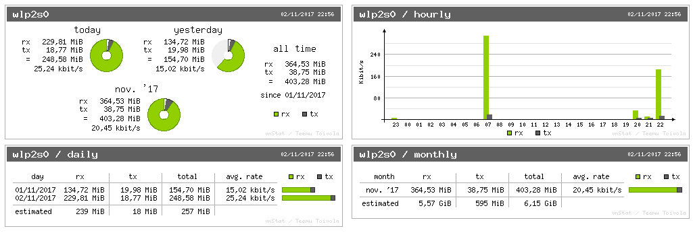

# vnStatUI

vnStatUI is a very lightweigth web UI for [vnStat](http://humdi.net/vnstat/). vnStatUI is a very tiny service that used vnstati to generate some charts.

## Dependancies

- vnstat
- vnstati (included with vnstat with mostly all distributions)
- systemd (for the daemon service)

## How to install it ?

- clone this repository or download current version [here](https://github.com/kuroidoruido/vnstatui/archive/master.zip) and extract all from zip
- go into the directory with a terminal
- run

> chmod +x vnstatui-setup.sh && sudo ./vnstatui-setup.sh

When script finished, all is done.

## How to use it ?

Go to [http://localhost:7991](http://localhost:7991).

## How does it look ?

